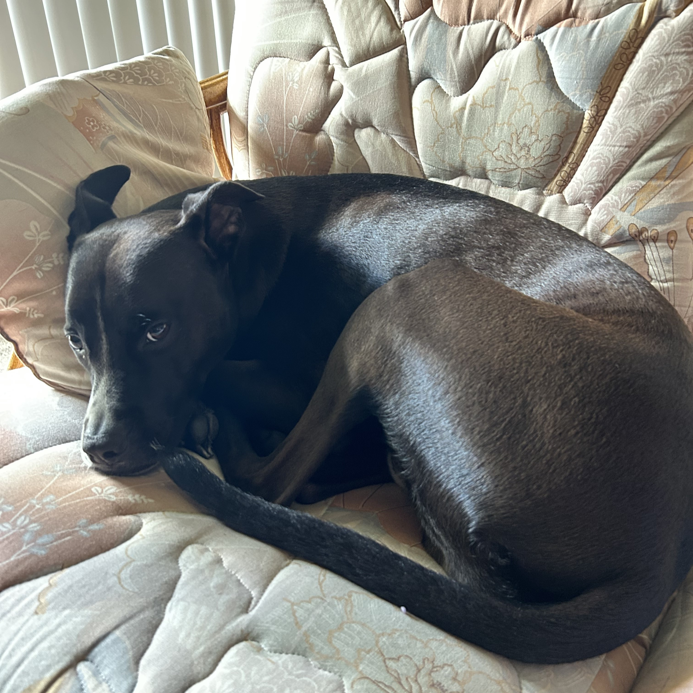

# Eric Hudec

## email: [hudece@oregonstate.edu](mailto:hudece@oregonstate.edu) | cell: 217-341-5975

 
--------------

I am a second year graduate student working in the Radiation Transport and Reactor Physics research group under the direction of Dr. Todd Palmer at Oregon State University. As a part of my research assistantship, I work with the Nuclear Criticality Safety Division at Lawrence Livermore National Lab, as an intern in the Integral Experiments group. My work with LLNL has primarily focused on the analysis of a benchmark experiment involving high-multiplication subcritical assemblies, including modelling the experimental setup in MCNP and performing uncertainty analysis. From July to December of 2023 I am working full time on this project to prepare a benchmark document for publication in 2024. The results from this experiment will also serve as the basis for my Master's Thesis, which will (hopefully) be complete in the summer of 2024.

I received my bachelor's degree in Physics from the University of Illinois in the spring of 2019. While completing my degree (and for some time after) I helped develop and operate a [physics-based escape room](https://www.nytimes.com/2019/05/04/science/escape-room-lab-physics.html) and worked as a mentor for the university's online math program. I also served bubble tea and frozen yogurt for a time, but found that this was not my life's calling. 

My personal interests include film, music, video games, college football, and taking my dog on walks. 
