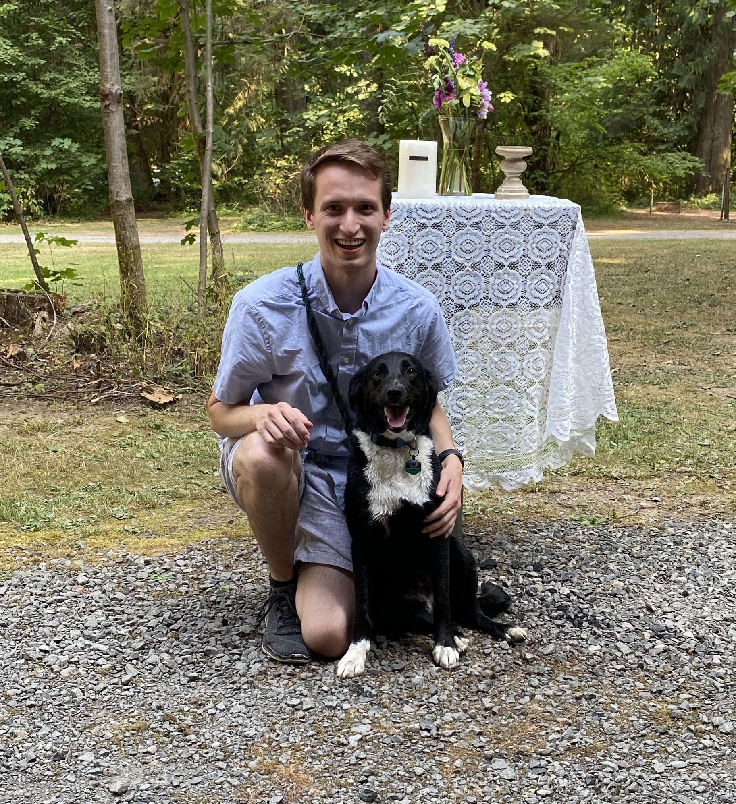

# Keenan Hoffman

Email me: [hoffmake@oregonstate.edu](mailto:hoffmake@oregonstate.edu)

I am a second year MS student working part time for Los Alamos National Laboratory while completing my thesis. I am using MCNP6 and CINDER90 to perform microreactor core depletion. Specifically, I am looking into potential advantages of depleting on an unstructured mesh (UM), compared to traditional constructive solid geometry (CSG).

My research interests include reactor design, Monte Carlo simulation, and numerical methods. I got my bachelor's degree in Nuclear Engineering from Oregon State University in 2021.

***

# Work Experience

## Microreactor UM fuel depletion, Los Alamos National Laboratory
- Systems Design and Analysis (NEN-5)
- Performed sensitivity studies on size and number of depletion regions using a TRISO fueled, graphite moderated, and heat pipe cooled microreactor model.
- Wrote Python scripts for data processing.
- Ran depletion studies using unstructured mesh elements as depletion zones.
- Continuing work for LANL during the school year as part of thesis research.

***

# Previous Work

## Graduate Research Assistant, Oregon State University
- Made SERPENT model of fuel rod from Sandia National Laboratory's Annular Core Research Reactor, for use in full core depletion study.
- Performed comparison depletion study using MCNP model.

## Graduate Teaching Assistant, Oregon State University
- Helped teach Neutronics I & II. Made answer keys, graded homework/tests, taught review sessions, and answered student questions.

***

## Extracurricular Interests
* My border collie, distance running, 3D printing, and video games.
