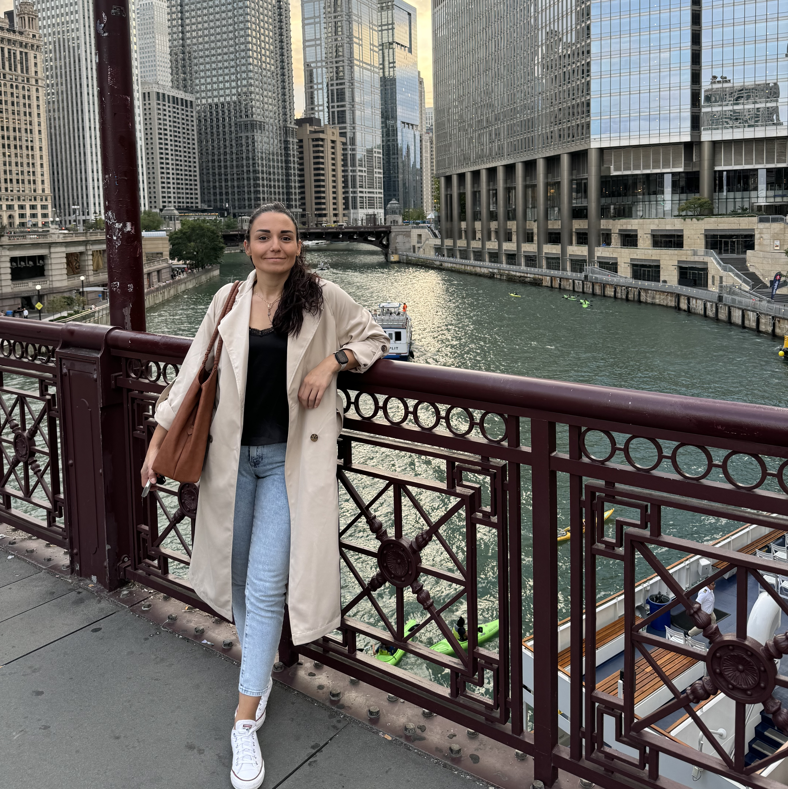

# Melek Derman

--------------

Email: [dermanm@oregonstate.edu](mailto:dermanm@oregonstate.edu)

I am a second year graduate student working under the supervision of Dr. Todd Palmer. During my first year, I worked with the Center for Exascale Monte Carlo Transport [CEMeNT](https://cement-psaap.github.io/), a PSAAP-III Focused Investigatory Center dedicated to advancing time-dependent Monte Carlo neutron transport simulation capabilities on exascale computing systems. My work supported optimization efforts for MC/DC through profiling studies, including running challenge problems with profiling tools, preparing a profiling repository for MC/DC, and integrating Omnitrace, the ROCm Systems Profiler, into our AMD systems. In my first year, I also gained some experience using MFEM for charged particle transport.

Beginning in my second year, I joined Center for Advancing the Radiation Resilience of Electronics [CARRE](https://carre-psaapiv.org/), a PSAAP-VI Predictive Simulation Center focused on advancing predictive simulation of radiation damage in electronic systems. By integrating multiscale, multiparticle physics with AI and exascale computing, CARRE aims to reduce reliance on physical testing and accelerate innovation in electronics resilience. Currently, I am contributing to this effort by implementing single-scattering electron transport capability in MCDC.

I received my B.S. in Physics from Akdeniz University and my M.S. in Nuclear Engineering from Texas A&M University, where I focused on nuclear safeguards monitoring approaches for molten salt reactors.
***

## Extracurricular Interests
- Photography
- Hiking
- Camping
- Cycling
- Gardening
- Reading