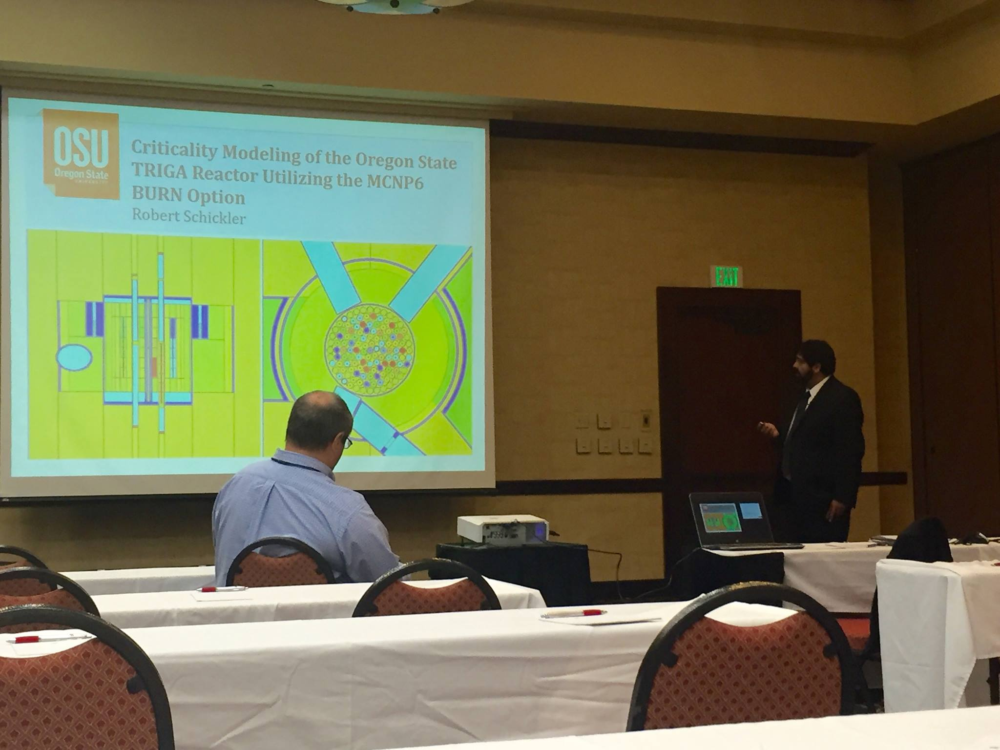

Robert Schickler
================================

I have been at Oregon State University since 2008, when I was initially hired at the Radiation Center to be a Nuclear Reactor Operator.  I am now a Reactor Engineer (and NRC-licensed Senior Reactor Operator); my main duties involve performing various analyses on our 1 MW TRIGA research reactor.  I obtained my master's degree in Nuclear Engineering in the fall of 2012 and am currently in my 2nd year as a Nuclear Engineering PhD student.  My advisor is Dr. Todd Palmer.

Email: <a href="mailto:robert.schickler@oregonstate.edu" target="top"> robert.schickler@oregonstate.edu </a>

***

## Current Projects

* Dissertation
  * Performing literature review during summer 2017 in anticipation of completing the preliminary examination in fall 2017
* Research
  * Analyzing the feasibility of inserting a second cadmium-lined in-core irradiation facility (CLICIT) into the TRIGA core to increase operating efficiency
  * Burnup calculations to track fuel depletion and plutonium production in TRIGA fuel
  * Molybdenum production research

***

### Upcoming Conferences

* Training, Research and Test Reactor (TRTR) Conference, San Diego, CA, August 2017
  "Installation of a Second CLICIT Facility at the Oregon State TRIGA Reactor"

***

### Personal interests
I am a huge fan of pop culture and would be a valuable asset to any trivia team.  I love TV/film/music and partake when time permits.

***

### Curriculum Vitae

<a href="files/schicklerCV.pdf">Click here for CV</a>

***
