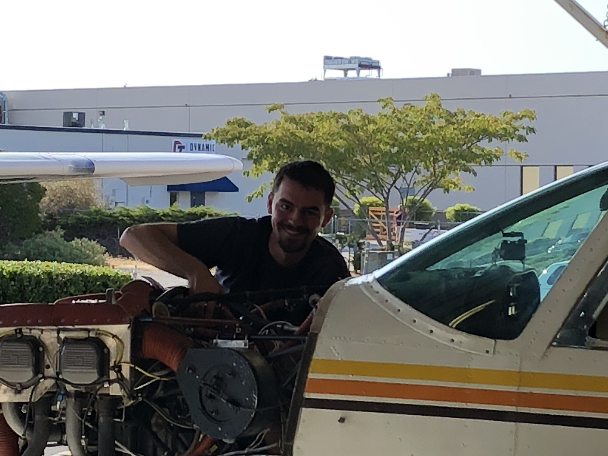
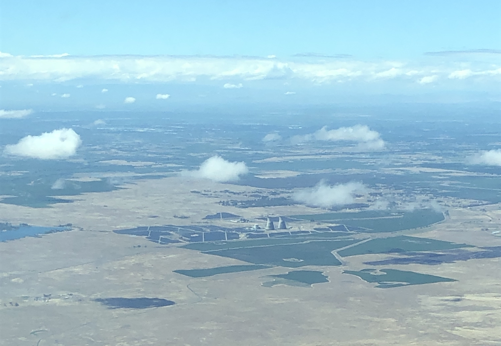

# Zane Tucker
-----

I am a new member of the RTRP group, having graduated Oregon State with a bachelor of science degree in nuclear engineering in summer of 2022. I will be working in the group initially toward a master of science degree, and ultimately (hopefully) a doctoral degree as well. I am also a licensed operator of the Oregon State TRIGA Reactor.

Prior to returning to undergraduate studies in 2019, I spent three full years (plus two summers) working as a mechanic for a refrigeration and HVAC service company focusing on large-capacity (commercial) refrigeration equipment in the Sacramento area of Northern California.

-----

*The Rancho Seco almost-NPP in Northern California.*
